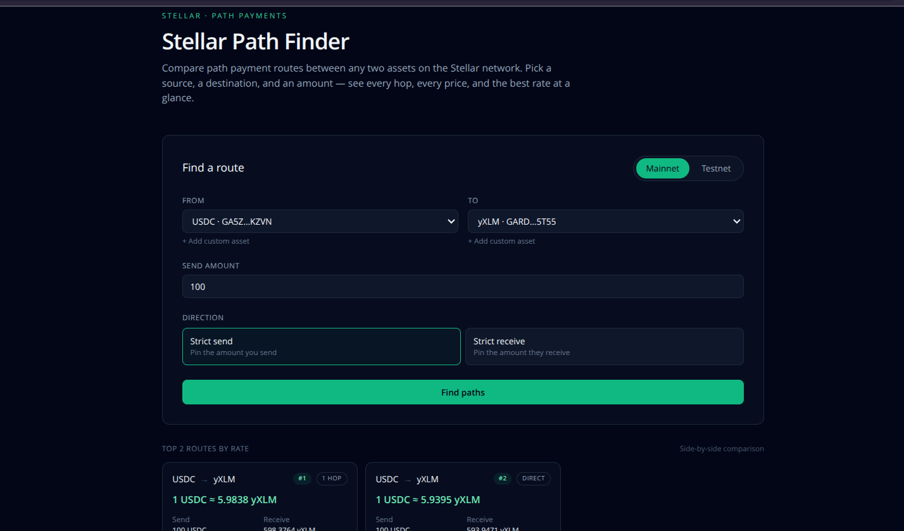
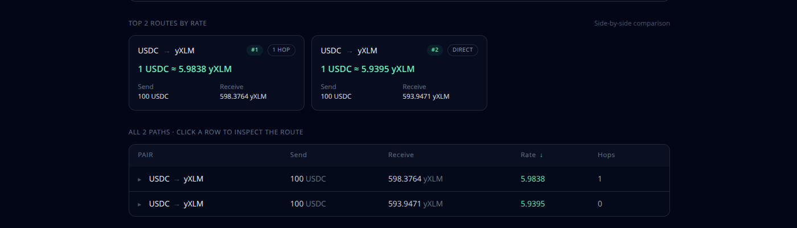
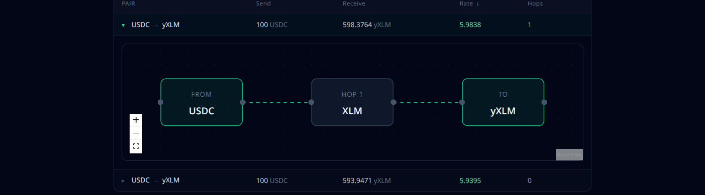

# Stellar Path Finder

A web app for comparing path payment routes between any two Stellar assets.

Stellar lets you send one asset and have the recipient receive a different asset, automatically routed through the network's built-in exchange. Multiple routes usually exist for the same pair, and they pay out different amounts. This tool fetches every available route for the assets you pick and lays them out side by side so you can see which one pays out the most.

It's the Skyscanner equivalent for Stellar path payments.

**Live demo:** https://stellar-path-finder.vercel.app

## Screenshots


<br><br>




## Motivation

Path payments are one of the most useful primitives on Stellar — they're how cross-asset remittance, in-wallet swaps, and most fiat on-ramps actually work under the hood. But almost every consumer wallet hides their routing logic behind a single "Swap" or "Send" button, and inspecting the routes yourself means hand-rolling Horizon queries and reading raw JSON.

This app makes those routes legible:

- Pick the assets and the amount you care about.
- See every route Horizon knows about, ranked by what the recipient actually receives.
- Inspect each route as a flow diagram so the hop-by-hop journey is obvious.

## Features

- **Strict-send and strict-receive search** against any Stellar network.
- **Curated asset list** with the major mainnet and testnet anchors, plus a **Custom asset** form for any classic `(code, issuer)` pair.
- **Sortable results table** by rate, send amount, receive amount, or hop count.
- **Top routes comparison strip** showing the best three side-by-side.
- **Per-route flow graph** powered by React Flow — click any row to expand it.
- **Mainnet / Testnet toggle** with localStorage-persisted preference.
- **Custom assets persist** across reloads, scoped per network.
- **Race-safe search** — switching networks or submitting again cancels in-flight requests instead of overwriting newer results with stale ones.

## Stack

- [Next.js 14](https://nextjs.org) (App Router) + TypeScript
- [Tailwind CSS](https://tailwindcss.com)
- [@stellar/stellar-sdk](https://github.com/stellar/js-stellar-sdk) v12 for Horizon access
- [React Flow](https://reactflow.dev) for the route diagrams

## Running it locally

```bash
npm install
npm run dev
```

Open http://localhost:3000. No environment variables are needed — Horizon's public endpoints are used directly.

## How a path payment works

A path payment lets you send asset A from your account and have the receiving account credited in asset B. The Stellar network finds a chain of order-book trades on SDEX (and classic AMM pools) that bridges A and B, executing every hop atomically inside a single operation. If no chain exists for the requested amount, the operation simply fails — you never end up with stuck funds in some intermediate asset.

Two flavours:

- **Strict-send** pins what you send. The recipient gets *at least* the minimum you specify; the rest depends on the route.
- **Strict-receive** pins what they receive. You send *at most* the maximum you specify.

Horizon's `/paths/strict-send` and `/paths/strict-receive` endpoints return every viable route for a given pair and amount. This app calls those endpoints and visualises the response.

## Roadmap

Things deliberately out of scope for the first release, in rough priority order:

- **Path-payment XDR export** — produce a ready-to-sign transaction envelope for the selected route, openable in [Stellar Lab](https://laboratory.stellar.org) or any wallet that imports XDR.
- **Per-hop pricing and slippage** — Horizon returns the chain of assets but not the price at each hop. We'd need to query SDEX order books per hop to surface this.
- **Soroban AMM routing** — Soroswap, Aquarius pools, and Phoenix DEX live entirely outside Horizon's path engine. Supporting them requires integrating each AMM's quoter contract and merging quotes alongside the classic SDEX paths.
- **Liquidity depth visualization** — bar charts of available depth at each pool/order book on the route.
- **Saved asset pairs** and one-click re-search.
- **Live polling** to track route quality over time.
- **Historical price charts** per asset pair.

## Documentation

- [Technical documentation](docs/documentation.md) - architecture, data flow, component breakdown, and how everything fits together.
- [Contributing guide](docs/contributing.md) - how to set up locally, branch conventions, PR guidelines, and ways to contribute.

## License

MIT
